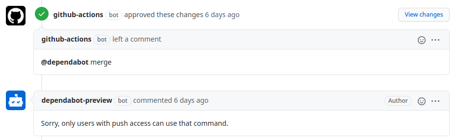

+++
title = "Github Actions"
date = 2020-11-01
[taxonomies]
tags = ["Github", "Github-Actions"]
+++

In the past few months I've ported most of my private and work projects from Travis-CI / Circle-CI to Github-Actions. It went well so far, but I've experienced some rough edges I want to tell you about.

## How do I handle private dependencies?

Since I come from Travis-CI and Circle-CI, it was difficult for me to figure out how to handle SSH-Keys to clone private repositories / dependencies. In Circle-CI  / Travis-CI you can enable SSH-Keys through the setting-section in the UI - but do Github-Actions have an UI for that? Presumably not, except that Github and the settings of your repositories are the UI. Took me a while to figure that out. Github-Actions are just another addon to Github. Everything plays well together, you just have to think that way. So, to be able to clone private dependencies, you have to declare a Github-Token. You can create a personal access token by visiting `Profile > Settings > Developer settings > Personal access tokens`, but Github offers us a global one as `GITHUB_TOKEN` by default. And this is how you use it:

```yml
- name: Some Github-Action
  uses: some/github-action@v1
  with:
    token: ${{ secrets.GITHUB_TOKEN }}
```

 - [uses](https://docs.github.com/en/free-pro-team@latest/actions/reference/workflow-syntax-for-github-actions#jobsjob_idstepsuses) let's you define a "reusable unit of code" or - in other words - an external Github-Action.
 - [with](https://docs.github.com/en/free-pro-team@latest/actions/reference/workflow-syntax-for-github-actions#jobsjob_idstepswith) is how you delegate arguments to that action. Pretty neat, isn't it?

Another example: As soon as new code is committed, you want to stop the previous
workflow immediately to not waste resources (since Github-Actions are not free for private repositories). But therefore you need a Github-Token to authorize that action. Here's the code:

```yml
- name: Cancel previous run
  uses: styfle/cancel-workflow-action@0.6.0
  with:
    access_token: ${{ secrets.GITHUB_TOKEN }}
```

## How do I handle dependency updates?

I use [dependabot](https://dependabot.com/) and the [Github
App](https://github.com/marketplace/dependabot-preview) for that particular
use-case but there are dozens of Github-Actions and apps out there. The
advantage of dependabot: it's easy to grasp and free of charge.

### auto-merge
dependabot will occasionally open Pull-Requests to update your
dependencies. Many of them can be merged without problems, but some will require
you to update your code. For those which can be merged without problems, we
usually don't want to review them. We want them to be merged immediately.
You can use [this github-action](https://github.com/marketplace/actions/dependabot-auto-merge) to accomplish that. I use it like this:

_.github/workflows/auto-merge.yml_
```yml
 - uses: ahmadnassri/action-dependabot-auto-merge@v2
   with:
     target: semver:patch
     github-token: ${{ secrets.REPO_GITHUB_TOKEN }}
```

Per default we just want to merge _patch_-level updates. Those shouldn't do any harm - as long as they follow [semver](https://semver.org/).

---
>You may have noticed the `${{ secrets.REPO_GITHUB_TOKEN }}` part. That's a **PAT**, a **P**ersonal-**A**ccess **T**oken. We have to use one, because otherwise we would get this:
>
>
>
>Only with a PAT we have push access.
---

Furthermore I use this configuration file

_.github/auto-merge.yml_
```yml
- match:
    dependency_type: development
    update_type: semver:minor

- match:
    dependency_type: production
    update_type: semver:patch
```

Which translates to: for _development_ dependencies we allow to automatically merge _patch_- **and** _minor_-level updates but for _production_ dependencies only _patch_-level ones (the default).

---

It seems that dependabot can do auto-merging [by itself](https://dependabot.com/docs/config-file/#automerged_updates) now, but it's still a good reference to show the difference between `${{ secrets.GITHUB_TOKEN }}` and the need for a PAT.

### auto-assign
It's always good to be informed when dependencies updates arrive. At least I would like to be assigned to the PR. If the PR gets automatically merged I've been informed and otherwise I have to review the PR and merge it by hand. That's where the [auto-assign action](https://github.com/marketplace/actions/auto-assign-action) should be used in your workflow:

```yml
 - uses: kentaro-m/auto-assign-action@v1.1.2
```

and my configuration file looks like this

_.github/auto_assign.yml_

```yml
# Set to true to add reviewers to pull requests
addReviewers: false
# Set to true to add assignees to pull requests
addAssignees: true
assignees:
  - Dgame
```

For other PR's you can provide reviewers as well, so that you don't have to do it manually. Sadly, it's not possible to assign reviewers based on words or context information, so in a large code-base it can be somewhat difficult. But additional use of [Code-Ownership](https://docs.github.com/en/free-pro-team@latest/github/creating-cloning-and-archiving-repositories/about-code-owners) should do the trick.

## How do I deploy to AWS-Lambda?

We have some Lambda Functions written in [Rust](https://www.rust-lang.org/). Whenever a branch is created, we want to be able to test that branch on our development environment on AWS. The artifacts (the executables) are stored in an S3 bucket and need to be placed in the specific lambda. I'll skip the test part:

```yml
name: Test & Deploy

on:
  pull_request:
    types:
      - opened
      - synchronize
      - reopened
      - ready_for_review
  push:
    branches:
      - master

jobs:
  tests:
    ...SKIP...
  deploy:
    needs: tests
    if: github.event.pull_request.draft == false
    runs-on: ubuntu-latest
    steps:
      - uses: actions/checkout@v2
      - name: Build with Lambda Docker Container
        run: docker run --rm \
          -v ${PWD}:/code \
          -v ${HOME}/.cargo/registry:/root/.cargo/registry \
          -v ${HOME}/.cargo/git:/root/.cargo/git \
          softprops/lambda-rust
      - uses: igordcsouza/github-action-get-branch-name@master
        env:
          GITHUB_TOKEN: ${{ secrets.GITHUB_TOKEN }}
      - name: Configure AWS credentials
        uses: aws-actions/configure-aws-credentials@v1
        with:
          aws-access-key-id: ${{ secrets.AWS_ACCESS_KEY_ID }}
          aws-secret-access-key: ${{ secrets.AWS_SECRET_ACCESS_KEY }}
          aws-region: ${{ secrets.AWS_REGION }}
      - name: S3 Upload
        run: |
          aws s3 cp ./target/lambda/release/lambda.zip s3://data/lambda-${BRANCH_NAME}.zip
```

 - `if: github.event.pull_request.draft == false`<br />
  Makes sure that draft PR's don't trigger this workflow
 - `needs: tests`<br />
  Make sure that the job `tests` has to succeed before the `deploy` job can start. If even one of the steps of the `tests` job fail, `deploy` won't be triggered.
 - `AWS_ACCESS_KEY_ID`, `AWS_SECRET_ACCESS_KEY`, `AWS_REGION`<br />Your AWS credentials, which must be kept as secrets in your repository.

## How do I let workflows interact with each other?

That was a tricky one: Recently I've enabled [molecule tests](https://molecule.readthedocs.io/en/latest/) for my [ansible-playbook](https://www.ansible.com/) collection [dgame-system](https://github.com/Dgame/dgame-system). Since those tests can take a while (20 to 40 minutes each) I got bored and thought "Why should I wait for the tests to complete and merge it afterwards if it can be automated?". Should be easy. Just wait for the tests to succeed and then merge. Ideally we should wait for review-requests, if needed. And it could be bothersome to merge each Pull-Request as soon as the tests passed. Maybe I want to add stuff to it later or just want to present a possible solution, which isn't final yet. Maybe we need more than green tests. Some sort of identification that we are ready and the PR can be merged as soon as all requirements are fulfilled. A _label_ perhaps. The label can be created / removed with [this](https://github.com/marketplace/actions/add-remove-label) Github-Action. So, what needs to be done?

 - Let's run the tests
 - As soon as the tests are green and all required reviewers have submitted their review (and only if a specific label is set) the PR should be merged

We only want the tests to run if new code is committed and we want to trigger the [auto-merge action](https://github.com/marketplace?query=auto+merge) (I'm using [this](https://github.com/pascalgn/automerge-action)) as soon as the tests pass (and if that specific label is set). That means we have two workflows: The first workflow is triggered as soon as the PR opens, reopens or gets synchronized (e.g. code is committed, another branch is merged, etc.) and the second workflow with the auto merge which is triggered by the first workflow, when the PR is labeled or a review is submitted. Here's the things: Github does not allow Workflows to trigger other Workflows to protect you from endless loops and things like that. So either we just use one workflow and have to mark the PR with the auto label **before** the tests are green or we have to figure out how one workflow can trigger another. For the lazy ones, here's the solution for the fist case:

_.github/workflows/workflow.yml_
```yml
name: Workflow
on:
  pull_request:
    types:
      - opened
      - synchronize
      - reopened
      - ready_for_review
jobs:
  tests:
    runs-on: ubuntu-latest
    steps:
      - uses: actions/checkout@v2
      - name: Run tests
        run: cargo test
  auto-merge:
    runs-on: ubuntu-latest
    needs: tests
    steps:
      - name: auto-merge
        uses: "pascalgn/automerge-action@v0.12.0"
        env:
          GITHUB_TOKEN: ${{ secrets.GITHUB_TOKEN }}
          MERGE_LABELS: "auto merge,!work in progress,!wip"
```

If you're still with me, here's the solution how one workflow can trigger
another. You may have an idea already. We could simply create a label and the second workflow reacts on that event. Well, Github still doesn't allow that. At least not, if you use your `${{ secrets.GITHUB_TOKEN }}` but [a clever guy](https://stackoverflow.com/a/64078507/6340462) figured out, that you can use a
personal access token instead. With this, Github does allow that the creation of e.g. a label triggers the second workflow and we're good to go. Here's the solution:

Here's how it works.


---

_.github/workflows/workflow.yml_
```yml
name: Workflow
on:
  pull_request:
    types:
      - opened
      - synchronize
      - reopened
      - ready_for_review
jobs:
  tests:
    runs-on: ubuntu-latest
    steps:
      - uses: actions/checkout@v2
      - name: remove label
        uses: buildsville/add-remove-label@v1
        with:
          token: ${{ secrets.GITHUB_TOKEN }}
          label: Ready
          type: remove
      - name: Run tests
        run: cargo test
  label-branch:
    runs-on: ubuntu-latest
    needs: tests
    steps:
      - name: add label
        uses: buildsville/add-remove-label@v1
        with:
          token: ${{ secrets.REPO_GITHUB_TOKEN }}
          label: Ready
          type: add
```

Before we can (re)add the label, we will remove it so that the corresponding event is reliably triggered.

---

_.github/workflows/auto-merge.yml_
```yml
name: auto-merge
on:
  pull_request:
    types:
      - labeled
jobs:
  auto-merge:
    runs-on: ubuntu-latest
    steps:
      - name: auto-merge
        uses: "pascalgn/automerge-action@v0.12.0"
        env:
          GITHUB_TOKEN: ${{ secrets.GITHUB_TOKEN }}
          MERGE_LABELS: "auto merge,!work in progress,!wip"
```
