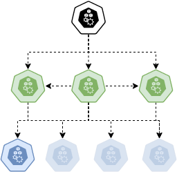

+++
title = "Test AWS locally with localstack by using Elasticsearch and Firehose"
date = 2021-05-29
[taxonomies]
tags = ["AWS", "Localstack", "Elasticsearch", "Firehose"]
+++
<style type="text/css">
.es_nodes {
    background: url("ES_Nodes.png") no-repeat;
}

.es_node {
    width: 50px;
    height: 49px;
    display: inline-block;
}

.es_active_data_node {
    background-position: 0 0;
}

.es_inactive_data_node {
    background-position: 0 -49px;
}

.es_electable_master_node {
    background-position: -50px 1px;
}

.es_elected_master_node {
    background-position: -50px -49px;
}

.es_coord_node {
    background-position: -100px 0;
}

.es_remote_client_node {
    background-position: -150px 0;
}

figure {
    float: right;
    width: 30%;
    min-height: 250px;
    font-style: italic;
    font-size: smaller;
    text-indent: 0;
    border: thin silver solid;
    margin: 0.5em;
    padding: 0.5em;
}

/* figure span {
    border: 1px solid #000;
} */

figure img {
    margin: 0;
}

figcaption {
    float: right;
}
</style>

Imagine you have a new project that includes the ability to search for certain documents. You choose Elasticsearch as the search technology (for obvious reasons) and - because it saves us a lot of manual work - you decide to host the project in **A**mazon **W**eb **S**ervice. That's fine, but you might only have the basic understanding of Elasticsearch, so how does it work? And how does it work in AWS? And wait a moment: How can I test it? Do we have to deploy everything we want to test?

Yeah, these are only a few of many valid questions. But we'll and should - as always - try to find a way to test locally as much as possible. This is a bit difficult with AWS, as it is mostly proprietary software. But since many tools, which automate the AWS deployment, use the [aws-cli](https://aws.amazon.com/de/cli/) and since it accepts everything as a request, we could mimic AWS with [Apache Kafka](https://kafka.apache.org/) for _Kinesis_ / _Firehose_ Streams, [ElasticMQ](https://github.com/softwaremill/elasticmq) for _SQS_ or even a simple [Elasticsearch](https://www.elastic.co/)-Cluster for AWS _Elasticsearch_ (which is a tiny bit different). Fortunately for us, others have done this before (but I might doing it for fun at a later date), and one of the best known is [localstack](https://localstack.cloud/). In this post I want to introduce you to Localstack and show you how to use it, some tricks and tweaks, and give you a more detailed understanding of Elasticsearch.


# localstack

[localstack](https://localstack.cloud/) is written in Python and can be used with Docker (as I would recommend). For that just create a `docker-compose.yml` file:

```yml
version: "3.7"

services:
  localstack:
    container_name: localstack_main
    image: localstack/localstack
    ports:
      - "${LOCALSTACK_EDGE_PORT-4566}:4566"
    environment:
      - DEBUG=1
      - DOCKER_HOST=unix:///var/run/docker.sock
      - DATA_DIR=.localstack/data
      - SERVICES=${LOCALSTACK_SERVICES}
    volumes:
      - ".localstack:/tmp/localstack"
      - "/var/run/docker.sock:/var/run/docker.sock"
```

- `DEBUG`: Just for troubleshooting Localstack issues
- `DATA_DIR`: Directory for saving persistent data. If not specified, no data is persisted. We want to persist our data in `./.localstack/data`.
- `SERVICES`: A comma separated list of AWS services we want to use. For example `es,kinesis,s3,sqs,firehose` whereby `es` stands for **E**lastic**S**earch Service.

We can start localstack by doing `docker-compose up -d` and now you can execute any aws-cli command you want to by specifiying the option `--endpoint-url=http://localhost:4566` (of course if you use another port as `4566` you have to adjust this):

```sh
aws --endpoint-url=http://localhost:4566 kinesis list-streams
```

would print

```json
{
    "StreamNames": []
}
```

Since we want to use Elasticsearch, we need a way to accept (or _index_ as Elasticsearch calls it) the data. We _could_ just use the HTTP requests to the cluster, but that wouldn't go very well if we somehow want to accept lots of data in a short amount of time. For that I recommend _AWS Firehose Streams_. You can specify those in such a way, that Firehose **automatically** _index_ the incoming data in your Elasticsearch Cluster. You just have to specify the `DomainARN` or `ClusterEndpoint` to your Elasticsearch Cluster. So if we want to use Elasticsearch and Firehose, our `SERVICE` for localstack should look like this:
`- SERVICES=es,firehose`.
But: how do we create our Elasticsearch Cluster? Well, first of all, AWS calls it an [Elasaticsearch Domain](https://docs.aws.amazon.com/elasticsearch-service/latest/developerguide/what-is-amazon-elasticsearch-service.html) and you can create it like this:

```sh
aws --endpoint-url $(LOCALSTACK_HOST) es create-elasticsearch-domain --domain-name es_local
```

We'll call our Cluster / Domain `es_local` but you can name it like you want to. If you want to make sure which Domains you have, you can do that with

```sh
aws --endpoint-url http://localhost:4566 es list-domain-names
```

and you can get every information of the Domain you want by

```sh
aws --endpoint-url http://localhost:4566 es describe-elasticsearch-domain --domain-name es_local
```

For the next steps of this post the only relevant information is the `ARN`. Now that this is taken care of, we just have to create the Firehose Stream. This contains a bit more information, but we'll talk about in just a second:

```sh
aws --endpoint-url http://localhost:4566 firehose create-delivery-stream --delivery-stream-name firehose_es_local_stream --delivery-stream-type DirectPut --elasticsearch-destination-configuration "RoleARN=arn:aws:iam::000000000000:role/Firehose-Reader-Role,ClusterEndpoint=http://esr_01:9200,IndexName=foo,ProcessingConfiguration={Enabled=false}"
```

We call the Firehose-Stream `firehose_es_local_stream` and we use the `DirectPut` mode, so that the data _provider_ (those who deliver incoming data that should be _indexed_) access the stream directly. The alternative would be `KinesisStreamAsSource` which (as the name suggest) uses a Kinesis Stream as source. But we don't want this indirection. The `--elasticsearch-destination-configuration` accepts a shorthand snytax of key-value pairs. The `RoleARN` is not that important for our local usage so just leave it as is. The important part is the `ClusterEndpoint`. You could als use the `DomainARN` but there are some troubles as of now, so we'll stick with `ClusterEndpoint` (in AWS you would of course use the `DomainARN`). Next is the `IndexName` (the name of the Elasticsearch [index](https://www.elastic.co/de/blog/what-is-an-elasticsearch-index)) which we'll call `foo` and last comes the `ProcessingConfiguration` where we just say "don't process our data, just send it to the Elasticsearch Cluster as is". Well that's that, if we want, we can now send data in. We do that by using

```sh
aws --endpoint-url http://localhost:4566 firehose put-record --delivery-stream-name firehose_es_local_stream --record '{"Data":"eyAidGFyZ2V0IjogImJlcnJ5IiB9"}'
```

`--record` accepts the incoming data only as json of the format

```json
{
  "Data": blob
}
```

where `blob` is in our case the base64 encoded data we want to send to Elasticsearch. But be warned, if your data is not valid json behind the base64 encoding you'll get an error for sure since Elasticsearch just stores json as documents. The data-blob `eyAidGFyZ2V0IjogImJlcnJ5IiB9` is the following base64 encoded json:

```json
{ "target": "berry" }
```

# Elasticsearch

## Nodes

<figure>
    <span class="es_nodes es_node es_remote_client_node"></span>
    <figcaption><a href="https://www.elastic.co/guide/en/elasticsearch/reference/current/modules-node.html#remote-node">Remote-Cluster-Client Nodes</a> are used to connect different Cluster so that the can exchange data and traffic</figcaption>
</figure>

<figure>
    <span class="es_nodes es_node es_active_data_node"></span>
    <figcaption>(Active) Data Node. <a href="https://www.elastic.co/guide/en/elasticsearch/reference/current/modules-node.html#data-node">Data Nodes</a> store the Cluster data and perform CRUD data operations</figcaption>
</figure>

<figure>
    <span class="es_nodes es_node es_electable_master_node"></span>
    <figcaption><a href="https://www.elastic.co/guide/en/elasticsearch/reference/current/modules-node.html#master-node">Electable Master Nodes</a> manage the Cluster. You'll need at least 3 of them in a multi-node (N > 1) Cluster</figcaption>
</figure>

<figure>
    <span class="es_nodes es_node es_coord_node"></span>
    <figcaption><a href="https://www.elastic.co/guide/en/elasticsearch/reference/current/modules-node.html#coordinating-node">Coordination Nodes</a> act as smart load-balancers for the Cluster. Usually you don't need more than one</figcaption>
</figure>

<figure>
    <span class="es_nodes es_node es_inactive_data_node"></span>
    <figcaption>(Inactive) Data Node. Same as (Active) Data Nodes just that they aren't active (in AWS they would be there for auto-scaling purposes)</figcaption>
</figure>

<figure>
    <span class="es_nodes es_node es_elected_master_node"></span>
    <figcaption>The <a href="https://www.elastic.co/guide/en/elasticsearch/reference/current/modules-node.html#master-node">Elected Master Node</a> is the one Node that manages the Cluster. The other _Electable Master Nodes_ are there as a backup in case the _Elected Master Node_ fails.</figcaption>
</figure>

## The Cluster

<figure>
    
    <figcaption>Cluster with elected Master Node</figcaption>
</figure>


<figure>
    
    <figcaption>The Cluster in Ressource-saving mode. Only the absolute necessary nodes are active.</figcaption>
</figure>

<figure>
    
    <figcaption>The Cluster</figcaption>
</figure>

<figure>
    
    <figcaption>The coordination node does not just coordinate the requests to the master nodes (as the previous image may have conveyed) but to the data nodes as well.</figcaption>
</figure>

<figure>
    
    <figcaption>Remote-Client Nodes are mainly used to connect clusters</figcaption>
</figure>