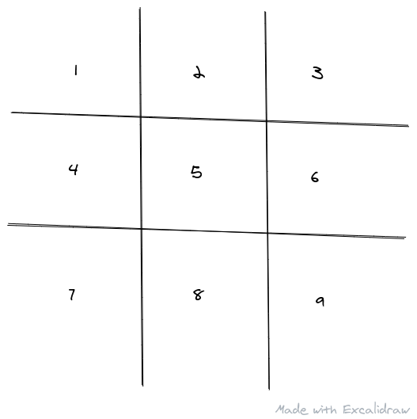
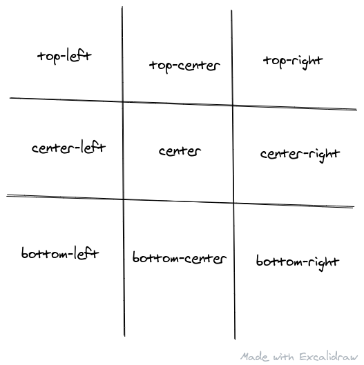
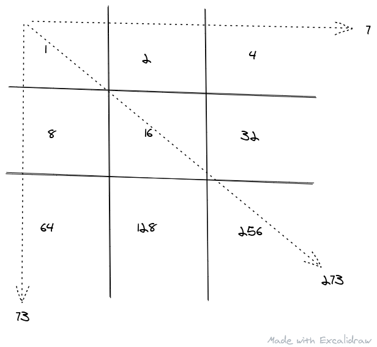
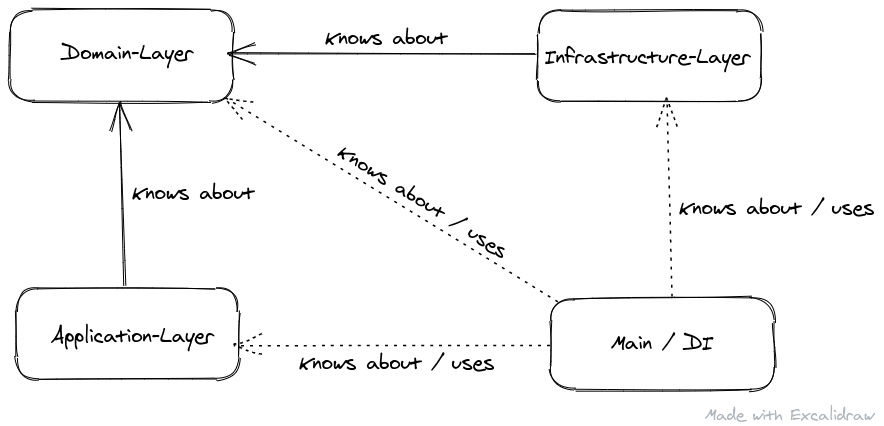

+++
title = "Tik-Tak-Toe in Rust in a DDD fashion"
date = 2020-12-16
[taxonomies]
tags = ["Rust", "DDD", "Game development"]
+++

Thanks to the current lockdown I'm reading a lot, currently about **D**omain **D**riven **D**esign. I just wanted to know more about it. But while I was reading, questions like "Well, in which context would that belong"? Or "How would I do that, if this condition has to be met?" popped up. So I've figured I should do an example project where I can apply my current know-how step by step by trial and error and enhance it while I'm learning more. I've decided to implement a simple "Tik-Tak-Toe" or "X-O" Game in Rust.

Tik-Tak-Toe is a game where you have 9 fields which can be filled by either X or O.



The first one decides whether he wants to play X or O for the rest of the game
by simply putting it in one of the fields. The opponent has to choose the
counterpart, so X if you choose O and O if you choose X. Then both players take turns. If you can place three of your marks in a horizontal, diagonal or vertical row, you win.

## Part 1: Assembling the Game

At first let's talk how we can assemble that Game piece by piece. While doing so, let's talk about the basics of DDD. In Part 2 we will focus on it in more detail.

First let's consider how we can design the fields or `Cell`s. And we've just got our first obstacle. How do we call it? `Field` or `Cell`? We have to decide not only how we developers will call it but also, how it will be called by other, non-technical people. That's why we need a [Ubiquitous Language](https://martinfowler.com/bliki/UbiquitousLanguage.html) to communicate quickly, easily and with as few misunderstandings as possible.

### Ubiquitous Language
A `Cell` is maybe a term a software-developer would choose. But not a non-technical person. So if we would choose `Cell` our communications would be something like this

<blockquote>
<strong>Developer</strong>: So if a Player marks the Cell with...<br />
<strong>Manager</strong>: Wait wait wait. What's a Cell? Do you mean one of the 9 fields?<br />
<strong>Developer</strong>: Yes, we call them Cells internally<br />
<strong>Manager</strong>: Right, I forgot! Please continue.
</blockquote>

And that will happen not once or twice but as often as both parties communicate. And imagine someone new comes into your developer team.

<blockquote>
<strong>New Developer</strong>: Hey Manager A told me to implement feature xyz to the fields but there is no field implementation?<br />
<strong>Other Developer</strong>: Right, we call them Cell, that's the term you have to search for.
</blockquote>

Calling it `Cell` will probably waste time, mind effort and it's error prone. `Field` is much clearer for both parties.

### Implementation

After this short warm-up, we will make sure to name things in a way that everyone quickly understands what is meant.

A `Field` can be taken or not. So, how about this?

```rust
pub struct Field {
    taken: bool
}
```

With that we would know that a `Field` is taken, but not by which player / which mark (X or O).

```rust
pub type Mark = char;

pub struct Field {
    mark: Option<Mark>
}
```

That's better. Now it **can** be marked with **any** character, including X and O. But the game is called X-O so we should make sure, that only those can be picked:

```rust
#[derive(Clone, Copy, Eq, PartialEq)]
pub enum Mark {
    X,
    O
}

pub struct Field {
    mark: Option<Mark>
}
```

Yeah, that's it. And while doing so we introduced our first Value-Object `Mark` and our first Entity-Object `Field`. Now we need a way to display the individual `Mark` with either `X` or `O` and give the `Field` some way to express if it's marked and if so, with what:

```rust
impl std::fmt::Display for Mark {
    fn fmt(&self, f: &mut std::fmt::Formatter) -> std::fmt::Result {
        match self {
            Self::X => write!(f, "X"),
            Self::O => write!(f, "O"),
        }
    }
}

impl Field {
    pub fn is_marked(&self) -> bool {
        self.mark.is_some()
    }

    pub fn is_marked_with(&self, mark: Mark) -> bool {
        if let Some(m) = self.mark {
            mark == m
        } else {
            false
        }
    }
}
```

So far, so good. Next we have to assemble those `Field`s in a 3x3 grid. And again: do we call it `Grid` or something better? A `Grid` is a bit clearer than `Cell` vs `Field` was, but is it good enough? If we play with random people, we won't call it `Grid`. Maybe `Playground`?

```rust
pub type Pixel = usize;

const DIMENSION: Pixel = 3;

pub struct Playground {
    field: [Field; DIMENSION * DIMENSION]
}
```

And here we introduced our second Entity-Object: `Playground`.
Now that this has been taken care of, let's speak about the arrangement of our fields and how we access them later. Our 1D 3x3 `Playground` will later be displayed as a 2D coordinate system like this:


So we have a x and y axis (we could also name it `row` and `column`) which can be transformed into an 1D index if we know the size with:

`y * PLAYGROUND_SIZE + x`

In Rust:

```rust
#[derive(Debug, PartialEq, Eq)]
pub struct PixelCoord {
    x: Pixel,
    y: Pixel
}

impl PixelCoord {
    pub fn index(&self) -> Pixel {
        self.y * DIMENSION + self.x
    }
}
```

With this we can equip our `Playground` with the helpful methods `is_field_occupied` and `mark_field_with` which both use a `PixelCoord` to calculate the index:

```rust
#[derive(Debug)]
pub enum FieldError {
    NoFieldAt(Pixel),
    Occupied(Pixel)
}

impl Playground {
    pub fn is_field_occupied(&self, coord: &PixelCoord) -> bool {
        if let Some(field) = self.fields.get(coord.index()) {
            field.is_marked()
        } else {
            false
        }
    }

    pub fn mark_field_with(&mut self, coord: &PixelCoord, mark: Mark) -> Result<(), FieldError> {
        let index = coord.index();
        if let Some(field) = self.fields.get_mut(index) {
            if field.is_marked() {
                Err(FieldError::Occupied(index))
            } else {
                field.mark = Some(mark);
                Ok(())
            }
        } else {
            Err(FieldError::NoFieldAt(index))
        }
    }
}
```

What's left are the Players. A `Player` needs a name, the mark he'll choose and probably some sort of playing strategy. A human player will be asked to type where they want to set their mark, but if we play against a bot, we have to use another strategy. But let's focus first on his name and `Mark`. So here we go:

```rust
pub struct Player {
    name: String,
    mark: Mark
}
```

Simple, right? Maybe too simple. We might have to check if `name` is not empty, not too short / not too long. So in DDD manner we should use a Value-Object:

```rust
#[derive(Debug)]
pub enum NameError {
    TooLong(usize),
    TooShort(usize)
}

const MIN_NAME_LEN: usize = 3;
const MAX_NAME_LEN: usize = 60;

pub struct Name(String);

impl std::fmt::Display for Name {
    fn fmt(&self, f: &mut std::fmt::Formatter) -> std::fmt::Result {
        write!(f, "{}", self.0)
    }
}

impl TryFrom<&str> for Name {
    type Error = NameError;

    fn try_from(s: &str) -> Result<Self, NameError> {
        let s = s.trim();
        let len = s.len();

        if len < MIN_NAME_LEN {
            Err(NameError::TooShort(len))
        } else if len > MAX_NAME_LEN {
            Err(NameError::TooLong(len))
        } else {
            Ok(Self(s.to_string()))
        }
    }
}

pub struct Player {
    name: Name,
    mark: Mark
}
```

Another runtime check which was taken care of by wrapping it in it's own type, great! But we have another problem: Nothing prevents us from doing

```rust
let player_1 = Player { name: "Foo".try_into()?, mark: Mark::X };
let player_2 = Player { name: "Bar".try_into()?, mark: Mark::X };
```

Both players can use the same `Mark`! It could just be a copy-paste error or a typo, but it's still error prone. Let's think of another approach. Regarding the alternative name "X-O" we just have two options: either you choose X or O. So let's wrap that up in another Value-Object:

```rust
pub enum Player {
    X(Name),
    O(Name)
}
```

Now we have both, `Mark::X` and `Player::X` and the same goes for "O". Should we change our `Field` structure too?

```rust
pub struct Field {
    mark: Option<Player>
}
```

Well, with that a `Field` could **own** a player which seems kinda wrong..

```rust
pub struct Field<'a> {
    marked_by: Option<&'a Player>
}
```

That's better, it can borrow a `Player`. But that doesn't seem right, does it? Why should a `Field` know which player has marked it? If we go with this `Field` - `Player` relationship it should be reversed: The player should know his `Field`'s but not the other way around. Thinking again, we should just stick with our old approach:

```rust
pub struct Field {
    mark: Option<Mark>
}
```

Even if X and O are doubled, `Player` and `Field` stays decoupled which is way more important.

What's left is the different strategies we'll use. We could use a `trait` or `interface` as it's called in other languages:

```rust
pub trait PositionStrategy {
    fn get_position(&self) -> PixelCoord;
}
```

Now we have different ways how to "tell" the Player, which strategy he'll use. First with a generic type information:

```rust
pub enum Player<'a, S: PositionStrategy> {
    X(Name, S),
    O(Name, S)
}
```

or by using dynamic dispatch binding:

```rust
pub enum Player<'a> {
    X(Name, &'a dyn PositionStrategy),
    O(Name, &'a dyn PositionStrategy)
}
```

One problem with the first approach is, that the generic has to be declared in every struct that holds a `Player`. So variant #2 seems a bit more "low-noise". Let's improve it by using fields:

```rust
pub enum Player<'a> {
    X {
        name: Name,
        strategy: &'a dyn PositionStrategy
    },
    O {
        name: Name,
        strategy: &'a dyn PositionStrategy
    },
}
```

But this is a bit redundant, so why not use this?

```rust
pub struct Player<'a> {
    name: Name,
    strategy: &'a dyn PositionStrategy
}

pub enum Mark<'a> {
    X(Player<'a>),
    O(Player<'a>),
}
```

This approach is still bothering me, maybe we're over-engineering it. Let's take a step back. If we think carefully, we only have two options: either it's a human player which will be asked for his choice or it's a KI which will place it's mark with a certain strategy. But either way, it stays the same for each human that plays and for each KI. So, how about this?

```rust
pub enum Player {
    Human {
        name: Name
    },
    KI
}

pub enum Marker {
    X(Player),
    O(Player)
}
```

**Two problems remain**:
 - We still can assign the same player to X and O. That's a problem we can only solve at runtime by comparing the players and - if both are humans - the name.
 - We now can assign X or O twice because of the type `Marker`. We should make X and O to be their very own types:

```rust
pub struct X {
    player: Player
}

pub struct O {
    player: Player
}
```

But we still need some sort of generic representation for a mark so that `Field` can take either X or O. Let's try this approach:

```rust
pub trait Marker {
    fn get_mark(&self) -> Mark;
}

pub struct X {
    player: Player
}

impl Marker for X {
    fn get_mark(&self) -> Mark {
        Mark::X
    }
}

pub struct O {
    player: Player
}

impl Marker for O {
    fn get_mark(&self) -> Mark {
        Mark::O
    }
}
```

So far, so good. What's missing?
 - how the user-input is accepted and converted
 - how we decide if X or O has won
 - the alternating game play between X and O
 - the display of our game play

### Directions

Let's start with directions. For now, our simple KI can output just random coordinates which - if they aren't taken already - will be marked. Later we could introduce a smarter solution, but that will not be covered by this post. So, let's talk about how the human player is inserting his choice. We have 9 fields from _top-left_ to _bottom-right_. We can express each of those 9 fields by combining 5 directions:

 - top
 - left
 - center
 - bottom
 - right

```rust
pub enum Direction {
    Top,
    Bottom,
    Left,
    Right,
    Center
}
```

Of course, only certain combinations make sense. `top-left` is perfectly fine, but `top-bottom` is not. Since we're dealing with external input, we should better be safe than sorry about how careful we parse it.



If the player inserts "center-right" we want the coordinate `2 / 1` or in other words the index `1 * 3 + 2 = 5`

Since we're dealing with a 2 dimensional point of view, we should revise our early implementation of the coordinate-system. Instead of a fixed `PixelCoord` we could use a few more abstractions:

```rust
pub struct Coord<T> {
    x: T,
    y: T,
}

pub type PixelCoord = Coord<Pixel>;
pub type DirectionCoord = Coord<Direction>;
```

In DDD both of them are Value-Objects.

To parse an input like `top-left` we have to split the hyphen and parse both words as single `Direction`s. If the string does not contain a hyphen, only "center" is a valid input. If there's a hyphen, there can only be one, which separates the two directions:

```rust
#[derive(Debug, PartialEq, Eq)]
pub enum DirectionError {
    TooManyParts,
    UnknownDirection
}

impl TryFrom<&str> for DirectionCoord {
    type Error = DirectionError;

    fn try_from(s: &str) -> Result<Self, Self::Error> {
        let s = s.trim().to_ascii_lowercase();
        if s.contains('-') {
            let mut parts = s.split('-');
            match (parts.next(), parts.next(), parts.next()) {
                (Some(dx), Some(dy), None) => Ok(DirectionCoord {
                    x: Direction::parse_str(dx)?,
                    y: Direction::parse_str(dy)?,
                }),
                _ => Err(DirectionError::TooManyParts),
            }
        } else if s == "center" {
            Ok (DirectionCoord { x: Direction::Center, y: Direction::Center })
        } else {
            Err(DirectionError::UnknownDirection)
        }
    }
}

impl Direction {
    fn parse_str(s: &str) -> Result<Self, DirectionError> {
        match s.trim().to_ascii_lowercase().as_ref() {
            "top" => Ok(Self::Top),
            "bottom" => Ok(Self::Bottom),
            "left" => Ok(Self::Left),
            "right" => Ok(Self::Right),
            "center" => Ok(Self::Center),
            _ => Err(DirectionError),
        }
    }
}
```

But we would still accept invalid inputs like "top-bottom" you might say. And you're right! `Direction` is not expressive enough: we cannot distinguish between `Row` directions like left, right, center and `Column` directions like top, bottom, center. So let's split things up:

```rust
#[derive(Debug, PartialEq, Eq)]
pub enum DirectionError {
    TooManyParts,
    UnknownDirection,
    UnknownRow,
    UnknownColumn
}

pub enum Row {
    Left, Right, Center
}

impl Row {
    pub fn parse_str(s: &str) -> Result<Self, DirectionError> {
        match s.trim().to_ascii_lowercase().as_ref() {
            "left" => Ok(Self::Left),
            "right" => Ok(Self::Right),
            "center" => Ok(Self::Center),
            _ => Err(DirectionError::UnknownRow),
        }
    }
}

pub enum Column {
    Top, Bottom, Center
}

impl Column {
    pub fn parse_str(s: &str) -> Result<Self, DirectionError> {
        match s.trim().to_ascii_lowercase().as_ref() {
            "top" => Ok(Self::Top),
            "bottom" => Ok(Self::Bottom),
            "center" => Ok(Self::Center),
            _ => Err(DirectionError::UnknownColumn),
        }
    }
}

fn parse_direction(s: &str) -> Result<(Row, Column), DirectionError> {
    let s = s.trim().to_ascii_lowercase();
    if s.contains('-') {
        let mut parts = s.split('-');
        match (parts.next(), parts.next(), parts.next()) {
            // if you enter "top-left"
            (Some(first_part), Some(second_part), None) => match (Row::parse_str(second_part), Column::parse_str(first_part)) {
                (Ok(row), Ok(column)) => Ok((row, column)),
                // if you enter "left-top"
                _ => Ok((Row::parse_str(first_part)?, Column::parse_str(second_part)?)),
            },
            _ => Err(DirectionError::TooManyParts),
        }
    } else if s == "center" {
        Ok((Row::Center, Column::Center))
    } else {
        Err(DirectionError::UnknownDirection)
    }
}
```

Much better. Not only would an input like "top-bottom" now be a `DirectionError`, we also don't have to revise the implementation of our coordinate-system!

Now that we can translate user input into a `Row` and a `Column`, we need a way to convert those to `PixelCoord`inates:

```rust
impl Row {
    // parse_str

    pub fn as_pixel(&self) -> Pixel {
        match self {
            Self::Left => 0,
            Self::Center => 1,
            Self::Right => 2,
        }
    }
}

impl Column {
    // parse_str

    pub fn as_pixel(&self) -> Pixel {
        match self {
            Self::Top => 0,
            Self::Center => 1,
            Self::Bottom => 2,
        }
    }
}

impl TryFrom<&str> for PixelCoord {
    type Error = DirectionError;

    fn try_from(s: &str) -> Result<Self, Self::Error> {
        let (row, column) = parse_direction(s)?;

        Ok(PixelCoord {
            x: row.as_pixel(),
            y: column.as_pixel(),
        })
    }
}
```

### Winning

Initially we quoted that the game is won "if you can place three of your marks
in a horizontal, diagonal or vertical row". It's easy to see that as a Human,
but it's not that obvious for a program.
We could iterate twice (for each player) through each column, row and of course diagonally and check, if it's filled with X or O. Another approach would be to fill all of the `Field`s with powers of 2 from 0 onwards: `2⁰`, `2¹`, `2²` and so on from top-left to bottom-right row by row:


Which translates to


If we add the numbers in each row, column and diagonally (from top-left to bottom-right and top-right to bottom-left) we get this:



All in all we get 8 (3 `Row`s + 3 `Column`s + 2 diagonal) possible winning scores:

`7, 56, 73, 84, 146, 273, 292, 448`

With that in mind, we can iterate twice (once per `Player`) through all `Field`s. If the current `Field` is marked by the `Player` we'll add `2^i` to a counter variable, where `i` is the index of the `Field` (`i` is `>=` 0 and `<=` 8). If the calculated score for that `Player` is "within" the `WINNING_SCORES`, he has won.

```rust
const WINNING_SCORES: [usize; 8] = [7, 56, 73, 84, 146, 273, 292, 448];
const WINNING_SCORE_BASE: usize = 2;

impl Playground {
    // ...

    pub fn has_won(&self, mark: Mark) -> bool {
        let score: usize = self.fields.iter().enumerate().map(|(index, field)| if field.is_marked_with(mark) {
            WINNING_SCORE_BASE.pow(index as u32)
        } else {
            0
        }).sum();

        WINNING_SCORES.iter().any(|winning_score| (winning_score & score) == *winning_score)
    }
}
```

----
We've said "within", but what _exactly_ is `(winning_score & score) == winning_score` doing?
Let's imagine we've marked all `Field`s in the first row and the first `Field` of the second row. So our score would be `1 + 2 + 4 + 8 = 15`. Now we iterate through all `WINNING_SCORES` and stop as soon as we find a match which indicates that we've won. The first `winning_score` is 7. 7 in it's bit-representation is `0111`. Our `score` 15 as bit-representation is `1111`. If we do 7 & 15 we compare each of the bits one by one and put down a 1 if both bits are 1 and 0 otherwise. So we get this:
```
0111
1111
----
0111
```

which is 7 again and since 7 is equal to 7 => we've found a match which means the `Player` has won!

----

### Alternating between X and O

At the start of this Post we wrote that "both players take turns". That should be easy, right? Like in reality, we could just "remember" whoever took the last turn:

```rust
impl Playground {
    // ...

    // To avoid dead-locks and therefore endless loops
    pub fn is_full(&self) -> bool {
        self.fields.iter().all(|field| field.is_marked())
    }
}

pub enum Turn {
    X,
    O
}

pub struct Game {
    playground: Playground,
    x: X,
    o: O,
    turn: Turn
}

impl Game {
    // ...

    pub fn play(&mut self) {
        loop {
            let (pos, mark) = match self.turn {
                Turn::X => {
                    self.turn = Turn::O; // <-- Here we reverse it
                    (self.get_x_position(), Mark::X)
                },
                Turn::O => {
                    self.turn = Turn::X; // <-- Here we reverse it
                    (self.get_y_position(), Mark::O)
                }
            };

            self.playground.mark_field_with(&pos, mark);
            if self.playground.has_won(mark) {
                break;
            }
        }
    }

    // ...
}
```

Yay, we've got us another X-O enum! Did you notice that X O X and O X O pattern in the `play` method? Looks like some sort of emoticon. At least for me, that solution looks a bit confusing and error prone. Could it be that we are over-engineering to save minor code duplicates? Lets follow the [KISS principle](https://en.wikipedia.org/wiki/KISS_principle). We could just place the marks one after another:

```rust
impl Game {
    // ...

    pub fn play(&mut self) {
        loop {
            if self.playground.is_full() {
                // TODO: Tell us that it's a draw
                break;
            }

            let pos = self.get_x_position();
            self.playground.mark_field_with(&pos, Mark::X);
            if self.playground.has_won(Mark::X) {
                // TODO: Tell us that "X" has won
                break;
            }

            let pos = self.get_o_position();
            self.playground.mark_field_with(&pos, Mark::O);
            if self.playground.has_won(Mark::O) {
                // TODO: Tell us that "O" has won
                break;
            }
        }
    }
}
```

The `play` method has the same [SLOC](https://en.wikipedia.org/wiki/Source_lines_of_code) as before and it's much easier to grasp isn't it? And we can remove that `Turn` enum and the `turn` property in `Game`!

## Part 2: DDD

Domain-Driven-Design distinguishes between three layers:

 - The Domain-Layer, where our business logic lives
 - The Infrastructure-Layer, for concrete infrastructure implementation
 - The Application-Layer, where everything get's coordinated

Let's split it up:

### The Application-Layer

The application layer is the place were the components live, which are using and orchestrating other components. In DDD the application layer is only using components from itself or from the domain layer. Why not from the infrastructure layer you're asking? Well, we will speak about that shortly. So, which of the given components could be described as using and orchestrating other components? Right, just `Game`. So that's our only application layer component for now.

### The Domain-Layer

Here we will place our entire business logic, expressed through a company-wide ubiquitous language.
An ubiquitous language is a Must-Have. If your speaking about `Client`s but name them `User` in the code, you introduce confusion for all eternity. So, what of our current implementation is domain logic? Well, almost everything except `Game` as we've determined before.

### The Infrastructure-Layer
Remember that we want to ask the `Player` in which row /column he wants to place his mark? And that we want to tell everyone who has won? We haven't written that piece of code yet. And that's infrastructure specific. Neither the domain nor the application layer should care where the input comes from or is written to. They should only know that it is somehow possible. The where and how is implemented in it's own layer, which is the infrastructure layer.

Since the domain layer must know that it is somehow possible to write or read something, we define the corresponding `interface` there. We have different possible solutions.

We could just implement the behaviour like this:

```rust
pub mod domain {
    // ...

    pub trait Display {
        fn display(&self);
    }
}
```

```rust
pub mod infra {
    // ...

    pub mod terminal {
        use crate::domain::{Playground, Field, Display};

        impl Display for Playground {
            fn display(&self) {
                for (index, field) in self.fields.iter().enumerate() {
                    print!("[");
                    if let Some(ref mark) = field.mark {
                        print!("{}", mark);
                    } else {
                        print!(" ");
                    }
                    print!("]");

                    if (index + 1) % 3 == 0 {
                        println!("");
                    }
                }
            }
        }
    }
}
```

Which is somewhat comparable with the abstract factory pattern.
Or we could use the strategy pattern to inject a concrete strategy:

```rust
pub mod domain {
    // ...

    pub trait DisplayStrategy {
        fn display(&self, field: &Field);
    }

    pub struct Field<S: DisplayStrategy> {
        // ...
        strategy: S
    }

    impl<S: DisplayStrategy> Field<S> {
        // ...

        fn display(&self) {
            self.strategy.display(self);
        }
    }
}
```

Both implementations have advantages and disadvantages. But the biggest flaw is, that in both approaches `Field` (and also `Playground`) "knows" about the fact, that they somehow can be displayed. Why should a `Field` have knowledge about that fact? It's not relevant.
In the last approach the strategy had to accept the `Field` to display it and the `display` method in `Field` just propagated the call to the `display` of the strategy. Seems a bit meaningless, doesn't it? But we can use that approach and just *format* the `Field` / `Playground` through a external component that get's all necessary information from the `Field` / `Playground`. Fair enough, we might need a few getter methods, but we get rid of the needless knowledge that both components are displayable. Another component could then display the string representation. The interfaces are located at the domain layer, since the domain layer needs to know, that the functionality exists, but not how it's implemented:

```rust
mod domain {
    // ...

    pub trait FieldFormatter {
        fn format(&self, field: &Field) -> String;
    }

    pub trait PlaygroundDisplay {
        fn display(&self, playground: &Playground);
    }
}
```

The implementation will be located in the infrastructure layer:

```rust
mod domain {
    impl Field {
        // ...

        pub fn get_mark(&self) -> Option<&Mark> {
            self.mark.as_ref()
        }
    }

    impl Playground {
        // ...

        pub fn get_fields(&self) -> &[Field] {
            self.fields.as_ref()
        }
    }
}

mod infra {
    use crate::domain::{FieldFormatter, PlaygroundDisplay, Field, Playground};

    // ...

    pub struct BracketFieldFormatter;

    impl FieldFormatter for BracketFieldFormatter {
        fn format(&self, field: &Field) -> String {
            if let Some(ref mark) = field.get_mark() {
                format!("[{}]", mark)
            } else {
                String::from("[ ]")
            }
        }
    }

    pub struct TerminalPlaygroundDisplay<F: FieldFormatter> {
        formatter: F
    }

    impl<F: FieldFormatter> PlaygroundDisplay for TerminalPlaygroundDisplay<F>  {
        fn display(&self, playground: &Playground) {
            for (index, field) in playground.get_fields().iter().enumerate() {
                print!("{}", self.formatter.format(field));
                if (index + 1) % 3 == 0 {
                    println!();
                }
            }
        }
    }
}
```

As you can see, the domain layer is completly isolated from the other layers and the infrastrucutre only knows a few interfaces from the domain layer since it's implementing those. All in all we get the following relationships:



<small>DI: **D**ependency **I**njection</small>

But what about asking and reading the `Player` input?

```rust
mod domain {
    // ...

    pub trait Writer {
        fn writeln(&self, s: &str);
    }

    pub trait Reader {
        fn readln(&self) -> String;
    }
}
```

Since we only want to write a simple terminal game, the concrete implementations in the infrastructure layer looks like this:

```rust
mod infra {
    use crate::domain::{Writer, Reader};

    pub struct TerminalWriter;

    impl Writer for TerminalWriter {
        fn writeln(&self, output: &str) {
            println!("{}", output);
        }
    }

    pub struct TerminalReader;

    impl Reader for TerminalReader {
        fn readln(&self) -> String {
            use std::io::{self, BufRead};

            let mut line = String::new();
            let stdin = io::stdin();

            stdin.lock().read_line(&mut line).expect("could not read from stdin");

            line
        }
    }
}
```

And here's our missing usage of it:

```rust
mod app {
    impl Game {
        // ...

        pub fn play(&mut self) {
            loop {
                if self.playground.is_full() {
                    // Tell us that it's a draw
                    self.writer.writeln("We've reached a draw.");
                    break;
                }

                let pos = self.get_position(&self.x.player);
                self.playground.mark_field_with(&pos, Mark::X).expect("Could not mark that field with X");
                if self.playground.has_won(Mark::X) {
                    // Tell us that "X" has won
                    self.writer.writeln("X has WON");
                    break;
                }

                let pos = self.get_position(&self.o.player);
                self.playground.mark_field_with(&pos, Mark::O).expect("Could not mark that field with O");
                if self.playground.has_won(Mark::O) {
                    // Tell us that "O" has won
                    self.writer.writeln("O has WON");
                    break;
                }
            }
        }

        fn get_position(&self, player: &Player) -> PixelCoord {
            loop {
                let pos = match player {
                    Player::Human { name } => self.ask_for_direction(&name),
                    Player::KI => { /* random */ }
                };

                if !self.playground.is_field_occupied(&pos) {
                    return pos;
                }

                self.writer.writeln("That field is already taken. Please choose another.");
            }
        }

        // This is new!
        fn ask_for_direction(&self, name: &Name) -> PixelCoord {
            loop {
                let msg = format!(
                    "{} it's your turn. Where do you want to place your mark? Your input should be the column direction (top, center, bottom) and the row direction (left, center, right) separated by a minus, e.g. \"top-left\" or \"center\"",
                    name
                );
                self.writer.writeln(&msg);

                let input = self.reader.readln();
                if let Ok(pos) = PixelCoord::try_from(input.as_str()) {
                    return pos;
                }

                self.writer.writeln("That is not a valid input...");
            }
        }
    }
}
```

---

And that's it, we've got ourselves a working Tik-Tak-Toe Game and learnt something about DDD. The complete project can be found on [Github](https://github.com/Dgame/tik-tak-toe-ddd).
